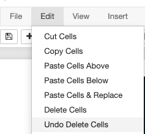

# Hackathon Challenges and Resources

These are notebooks and other resources to use as challenges for [Callysto](https://callysto.ca) hackathons or related events. You're also welcome to use them for other non-commercial purposes.

Notebooks in this branch were tested on [Callysto Hub](https://hub.callysto.ca).

### Callysto Hub basics
  
[Callysto Hub]((https://hub.callysto.ca)) is a free Jupyter notebook environment provided by [Cybera](https://www.cybera.ca) and [PIMS](https://www.pims.math.ca). 

To log in to [Callysto Hub]((https://hub.callysto.ca)) you can  use a Google or Microsoft account.  
     
The first time you log in your personal environment will be created where all your work will be stored.

### Copy notebooks to Callysto Hub
   
Hackathon notebooks can be automatically copied to your Callysto Hub environment using [this git-pull link](https://hub.callysto.ca/jupyter/hub/user-redirect/git-pull?repo=https://github.com/callysto/hackathon).
   
 Or to copy them  manually:
 
- Select `New` -> `Terminal` in the top right corner.
- In the terminal window type `git clone https://github.com/callysto/hackathon -b jupyter` 
- Close the web page with terminal once the repository has been copied.

  
### Open Notebooks in Callysto Hub
  
After you have copied the hackathon notebooks, to open them in Callysto Hub:

- Click on the logo in the top left corner, it will redirect you to the home screen.  
- Click on `hackathon` repository folder and select the folder or notebook you are planning to work on.

- To get started select the `Prep_materials` folder and work through the prepatory notebooks in this order: 
1) `Markdown basics.ipynb` 
2) `Python and pandas basics solutions.ipynb` 
3) `Matplotlib basics.ipynb` 
4) `Cufflinks basics.ipynb` 

## Some Jupyter Notebook Basics

### Run a cell
    
To run a cell, select it and then either:

 - click the `Cell` menu and select `Run Cells`
 - or hit `Shift-Enter`
 - or click the `Run` button in the toolbar
 
 
 
 ### Create a new cell

In order to create a new cell:
   
- click the `Insert` menu then select `Insert Cell Above` or `Insert Cell Below`  
- or click the plus button in the top left corner   
  

### Delete a cell
  
In order to delete a cell, select it and either:

 - click the `Edit` menu then select `Delete Cells`
 - or click on scisors button in the top left corner

 
 ### Undo deleting cells
    
 If you accidentally deleted an incorrect cell, you can always bring it back:
 - click the `Edit` menu then select `Undo Delete Cells`
    
 
 
### Download notebook

If you want to download the notebook in `.ipynb` format to your local machine:

- Save the notebook first:
    - click the `Save and checkpoint` button in the top left corner
- Click the `File` menu then select `Download as` -> `Notebook(.ipynb)`  

